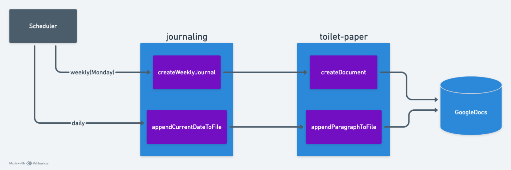

# journaling

This project is a Google Apps Script designed to automate the creation of journaling documents in Google Drive. It uses a library called `ToiletPaper` with a namespace `Tissuer` to manage Google Docs, with a playful and humorous theme.

## System Design

## Features

- Automatically creates a new journaling document named with the current date.
- Organizes documents into weekly folders.
- Uses a namespace structure to keep the code organized and modular.

## Setup

1. **Clone the repository or copy the code** into your Google Apps Script project.
2. **Ensure the `ToiletPaper` library is included** in your project:
   - In the Google Apps Script editor, go to `Resources` > `Libraries`.
   - Add the `ToiletPaper` library using its Script ID.

## Functions

- **createWeeklyJournal()**: Creates a new journaling document in the weekly folder.
- **appendCurrentDateToFile()**: Appends the current date to the existing journaling document as a heading.

